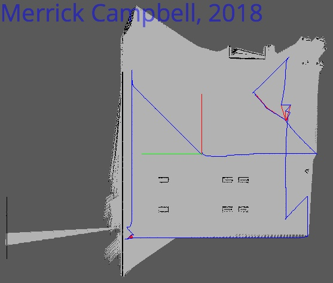

# RoboND-T2P3-RTABmapping

## Overview
Mapping is an important part of robot navigation, whether maps are preloaded onto a platform for Monte Carlo Localization or as part of a SLAM pipeline.  This project applies [Real Time Appearance Based (RTAB) Mapping](http://wiki.ros.org/rtabmap_ros) to map two different environments, an interior Kitchen World and an exterior Custom Firehouse Environment.  Both worlds could be successfully mapped in simulation using a differential drive robot with an RGBD camera and a laser scanner.  For each world, 2D and 3D maps of the environment were created.  Loop Closure was achieved 303 times for the Kitchen World and 27 times for the Custom Firehouse Environment.

### UDACITY: Kitchen World Environment
#### 2D Map

#### 3D Map

#### Database Viewer with Loop Closures (Purple)

### CUSTOM: Fire House World Environment
#### 2D Map

#### 3D Map

